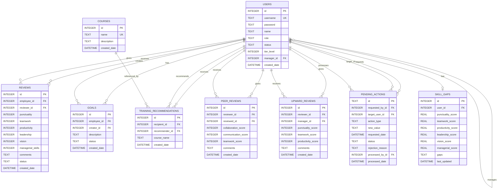

# Performance Review System - Database Documentation

## Table of Contents
1. [Entity Relationship Diagram (ERD)](#entity-relationship-diagram-erd)
2. [Table Mapping & Schema](#table-mapping--schema)
3. [Business Requirements](#business-requirements)

---

## Entity Relationship Diagram (ERD)



### ERD Visual Representation

```
┌─────────────────────────────────────────────────────────────────────────────────────────────────┐
│                              PERFORMANCE REVIEW SYSTEM ERD (9 Tables)                            │
└─────────────────────────────────────────────────────────────────────────────────────────────────┘

                                         ┌──────────────────┐
                                         │      USERS       │
                                         ├──────────────────┤
                                         │ PK id            │
                                         │    username (UK) │
                                         │    password      │
                                         │    name          │◄──────────────────────────┐
                                         │    role          │                           │
                                         │    status        │                           │
                                         │    tier_level    │                           │
                                         │ FK manager_id ───┼───────────────────────────┘
                                         │    created_date  │       (Self-Reference)
                                         └────────┬─────────┘
                                                  │
        ┌──────────────┬──────────────┬───────────┼───────────┬──────────────┬──────────────┐
        │              │              │           │           │              │              │
        ▼              ▼              ▼           ▼           ▼              ▼              ▼
┌──────────────┐ ┌──────────────┐ ┌──────────────┐ ┌──────────────┐ ┌──────────────┐ ┌──────────────┐
│   REVIEWS    │ │    GOALS     │ │TRAINING_RECS │ │ PEER_REVIEWS │ │UPWARD_REVIEWS│ │PENDING_ACTNS │
├──────────────┤ ├──────────────┤ ├──────────────┤ ├──────────────┤ ├──────────────┤ ├──────────────┤
│PK id         │ │PK id         │ │PK id         │ │PK id         │ │PK id         │ │PK id (UUID)  │
│FK employee_id│ │FK employee_id│ │FK recipient_id│ │FK reviewer_id│ │FK reviewer_id│ │FK requested_ │
│FK reviewer_id│ │FK creator_id │ │FK recommender│ │FK reviewed_id│ │FK manager_id │ │   by_id      │
│   punctuality│ │   description│ │   course_name│ │   collaborat │ │   punctuality│ │FK target_    │
│   teamwork   │ │   status     │ │   created_dt │ │   communicat │ │   teamwork   │ │   user_id    │
│   productiv. │ │   created_dt │ └──────────────┘ │   teamwork   │ │   productiv. │ │FK processed_ │
│   leadership │ └──────────────┘                  │   comments   │ │   comments   │ │   by_id      │
│   vision     │                                   │   created_dt │ │   created_dt │ │   action_type│
│   managerial │       ┌──────────────┐            └──────────────┘ └──────────────┘ │   status     │
│   comments   │       │   COURSES    │                                              │   new_value  │
│   status     │       ├──────────────┤                   ┌──────────────┐           └──────────────┘
│   created_dt │       │PK id         │                   │  SKILL_GAPS  │
└──────────────┘       │   name (UK)  │                   ├──────────────┤
                       │   description│                   │PK id         │
                       │   created_dt │                   │FK user_id(UK)│
                       └──────────────┘                   │   punctuality│
                                                          │   teamwork   │
                                                          │   productiv. │
                                                          │   leadership │
                                                          │   vision     │
                                                          │   managerial │
                                                          │   gaps       │
                                                          │   last_updt  │
                                                          └──────────────┘

═══════════════════════════════════════════════════════════════════════════════════════════════════
                                         TABLE SUMMARY
═══════════════════════════════════════════════════════════════════════════════════════════════════
  1. USERS                    - User accounts & organizational hierarchy (self-referencing)
  2. REVIEWS                  - Performance reviews (0-10 scale, 6 categories)
  3. GOALS                    - Employee goals with status tracking
  4. COURSES                  - Training course catalog
  5. TRAINING_RECOMMENDATIONS - Training assignments from managers
  6. PEER_REVIEWS             - Anonymous teammate reviews (1-5 scale, 3 categories)
  7. UPWARD_REVIEWS           - Anonymous manager reviews by direct reports
  8. PENDING_ACTIONS          - Manager requests requiring admin approval
  9. SKILL_GAPS               - Cached skill gap analysis results (1 per user)
═══════════════════════════════════════════════════════════════════════════════════════════════════
```

---

## Table Mapping & Schema

### 1. USERS Table

| Column | Data Type | Constraints | Description |
|--------|-----------|-------------|-------------|
| `id` | INTEGER | PRIMARY KEY, AUTOINCREMENT | Unique user identifier |
| `username` | TEXT | UNIQUE, NOT NULL | Login username |
| `password` | TEXT | NOT NULL | User password |
| `name` | TEXT | NOT NULL | Display name |
| `role` | TEXT | DEFAULT 'EMPLOYEE', CHECK | User role (see enum below) |
| `status` | TEXT | DEFAULT 'PENDING', CHECK | Account status (see enum below) |
| `tier_level` | INTEGER | DEFAULT 1 | Organizational hierarchy level |
| `manager_id` | INTEGER | FOREIGN KEY → users(id) | Reference to manager user |
| `created_date` | DATETIME | DEFAULT CURRENT_TIMESTAMP | Account creation date |

**Role Enum Values:**
- `ADMIN` - System administrator with full access
- `EMPLOYEE` - Regular employee (Tier 1)
- `MANAGER_EMPLOYEE` - Manager who is also an employee (Tier 2)
- `HIGHBOARD_MANAGER` - Senior/executive manager (Tier 3)

**Status Enum Values:**
- `ACTIVE` - Active user account
- `PENDING` - Awaiting approval
- `SUSPENDED` - Temporarily disabled

**Self-Referencing Relationship:**
- `manager_id` → `users.id` (ON DELETE SET NULL)

---

### 2. REVIEWS Table

| Column | Data Type | Constraints | Description |
|--------|-----------|-------------|-------------|
| `id` | INTEGER | PRIMARY KEY, AUTOINCREMENT | Unique review identifier |
| `employee_id` | INTEGER | NOT NULL, FOREIGN KEY | Employee being reviewed |
| `reviewer_id` | INTEGER | FOREIGN KEY | Person giving the review |
| `punctuality` | INTEGER | DEFAULT 0, CHECK(0-10) | Punctuality score |
| `teamwork` | INTEGER | DEFAULT 0, CHECK(0-10) | Teamwork score |
| `productivity` | INTEGER | DEFAULT 0, CHECK(0-10) | Productivity score |
| `leadership` | INTEGER | DEFAULT 0, CHECK(0-10) | Leadership score (managers only) |
| `vision` | INTEGER | DEFAULT 0, CHECK(0-10) | Vision score (managers only) |
| `managerial_skills` | INTEGER | DEFAULT 0, CHECK(0-10) | Managerial skills score (managers only) |
| `comments` | TEXT | - | Review comments/feedback |
| `status` | TEXT | DEFAULT 'SUBMITTED' | Review status |
| `created_date` | DATETIME | DEFAULT CURRENT_TIMESTAMP | Review creation date |

**Foreign Key Relationships:**
- `employee_id` → `users.id` (ON DELETE CASCADE)
- `reviewer_id` → `users.id` (ON DELETE SET NULL)

**Score Categories:**
- **Basic (All Employees):** Punctuality, Teamwork, Productivity
- **Extended (Managers Only):** Leadership, Vision, Managerial Skills

---

### 3. GOALS Table

| Column | Data Type | Constraints | Description |
|--------|-----------|-------------|-------------|
| `id` | INTEGER | PRIMARY KEY, AUTOINCREMENT | Unique goal identifier |
| `employee_id` | INTEGER | NOT NULL, FOREIGN KEY | Employee the goal belongs to |
| `creator_id` | INTEGER | FOREIGN KEY | Person who created the goal |
| `description` | TEXT | NOT NULL | Goal description |
| `status` | TEXT | DEFAULT 'ACTIVE', CHECK | Goal status |
| `created_date` | DATETIME | DEFAULT CURRENT_TIMESTAMP | Goal creation date |

**Status Enum Values:**
- `ACTIVE` - Goal is in progress
- `COMPLETED` - Goal has been achieved

**Foreign Key Relationships:**
- `employee_id` → `users.id` (ON DELETE CASCADE)
- `creator_id` → `users.id` (ON DELETE SET NULL)

---

### 4. COURSES Table

| Column | Data Type | Constraints | Description |
|--------|-----------|-------------|-------------|
| `id` | INTEGER | PRIMARY KEY, AUTOINCREMENT | Unique course identifier |
| `name` | TEXT | UNIQUE, NOT NULL | Course name |
| `description` | TEXT | - | Course description |
| `created_date` | DATETIME | DEFAULT CURRENT_TIMESTAMP | Course creation date |

---

### 5. TRAINING_RECOMMENDATIONS Table

| Column | Data Type | Constraints | Description |
|--------|-----------|-------------|-------------|
| `id` | INTEGER | PRIMARY KEY, AUTOINCREMENT | Unique recommendation identifier |
| `recipient_id` | INTEGER | NOT NULL, FOREIGN KEY | Employee receiving the recommendation |
| `recommender_id` | INTEGER | FOREIGN KEY | Person making the recommendation |
| `course_name` | TEXT | NOT NULL | Name of recommended course |
| `created_date` | DATETIME | DEFAULT CURRENT_TIMESTAMP | Recommendation date |

**Foreign Key Relationships:**
- `recipient_id` → `users.id` (ON DELETE CASCADE)
- `recommender_id` → `users.id` (ON DELETE SET NULL)

---

### 6. PEER_REVIEWS Table

| Column | Data Type | Constraints | Description |
|--------|-----------|-------------|-------------|
| `id` | INTEGER | PRIMARY KEY, AUTOINCREMENT | Unique peer review identifier |
| `reviewer_id` | INTEGER | NOT NULL, FOREIGN KEY | Employee giving the review |
| `reviewed_id` | INTEGER | NOT NULL, FOREIGN KEY | Teammate being reviewed |
| `collaboration_score` | INTEGER | DEFAULT 0, CHECK(1-5) | Collaboration score |
| `communication_score` | INTEGER | DEFAULT 0, CHECK(1-5) | Communication score |
| `teamwork_score` | INTEGER | DEFAULT 0, CHECK(1-5) | Teamwork score |
| `comments` | TEXT | - | Review comments |
| `created_date` | DATETIME | DEFAULT CURRENT_TIMESTAMP | Review creation date |

**Foreign Key Relationships:**
- `reviewer_id` → `users.id` (ON DELETE CASCADE)
- `reviewed_id` → `users.id` (ON DELETE CASCADE)

**Business Rules:**
- Reviewer and reviewed must share the same manager
- Reviews are anonymous (reviewer not exposed to reviewed user)

---

### 7. UPWARD_REVIEWS Table

| Column | Data Type | Constraints | Description |
|--------|-----------|-------------|-------------|
| `id` | INTEGER | PRIMARY KEY, AUTOINCREMENT | Unique upward review identifier |
| `reviewer_id` | INTEGER | NOT NULL, FOREIGN KEY | Employee giving the review |
| `manager_id` | INTEGER | NOT NULL, FOREIGN KEY | Manager being reviewed |
| `punctuality_score` | INTEGER | DEFAULT 0, CHECK(1-5) | Punctuality score |
| `teamwork_score` | INTEGER | DEFAULT 0, CHECK(1-5) | Teamwork score |
| `productivity_score` | INTEGER | DEFAULT 0, CHECK(1-5) | Productivity score |
| `comments` | TEXT | - | Review comments |
| `created_date` | DATETIME | DEFAULT CURRENT_TIMESTAMP | Review creation date |

**Foreign Key Relationships:**
- `reviewer_id` → `users.id` (ON DELETE CASCADE)
- `manager_id` → `users.id` (ON DELETE CASCADE)

**Business Rules:**
- Reviewer must be a direct report of the manager
- Reviews are anonymous (reviewer not exposed to manager)

---

### 8. PENDING_ACTIONS Table

| Column | Data Type | Constraints | Description |
|--------|-----------|-------------|-------------|
| `id` | TEXT | PRIMARY KEY | UUID for unique action identifier |
| `requested_by_id` | INTEGER | NOT NULL, FOREIGN KEY | Manager who requested the action |
| `target_user_id` | INTEGER | NOT NULL, FOREIGN KEY | User affected by the action |
| `action_type` | TEXT | NOT NULL, CHECK | Action type (SUSPEND, CHANGE_TIER, DELETE) |
| `new_value` | TEXT | - | New value for the action (e.g., new tier level) |
| `requested_date` | DATETIME | DEFAULT CURRENT_TIMESTAMP | Request creation date |
| `status` | TEXT | DEFAULT 'PENDING', CHECK | Status (PENDING, APPROVED, REJECTED) |
| `rejection_reason` | TEXT | - | Reason for rejection (if rejected) |
| `processed_by_id` | INTEGER | FOREIGN KEY | Admin who processed the action |
| `processed_date` | DATETIME | - | Date when action was processed |

**Action Type Enum Values:**
- `SUSPEND` - Suspend user account
- `CHANGE_TIER` - Change user's tier level
- `DELETE` - Delete user account

**Status Enum Values:**
- `PENDING` - Awaiting admin approval
- `APPROVED` - Action approved and executed
- `REJECTED` - Action rejected by admin

**Foreign Key Relationships:**
- `requested_by_id` → `users.id` (ON DELETE CASCADE)
- `target_user_id` → `users.id` (ON DELETE CASCADE)
- `processed_by_id` → `users.id` (ON DELETE SET NULL)

---

### 9. SKILL_GAPS Table

| Column | Data Type | Constraints | Description |
|--------|-----------|-------------|-------------|
| `id` | INTEGER | PRIMARY KEY, AUTOINCREMENT | Unique skill gap record identifier |
| `user_id` | INTEGER | NOT NULL, UNIQUE, FOREIGN KEY | User the analysis belongs to |
| `punctuality_score` | REAL | DEFAULT 0 | Average punctuality score |
| `teamwork_score` | REAL | DEFAULT 0 | Average teamwork score |
| `productivity_score` | REAL | DEFAULT 0 | Average productivity score |
| `leadership_score` | REAL | DEFAULT 0 | Average leadership score (managers) |
| `vision_score` | REAL | DEFAULT 0 | Average vision score (managers) |
| `managerial_score` | REAL | DEFAULT 0 | Average managerial score (managers) |
| `gaps` | TEXT | - | Comma-separated list of identified gaps |
| `last_updated` | DATETIME | DEFAULT CURRENT_TIMESTAMP | Last analysis date |

**Foreign Key Relationships:**
- `user_id` → `users.id` (ON DELETE CASCADE)

**Business Rules:**
- One skill gap record per user (UNIQUE constraint on user_id)
- Scores below 3.0 are considered skill gaps
- Extended metrics (leadership, vision, managerial) only tracked for managers

---

## Relationship Mapping Summary

| Relationship | Type | Description |
|--------------|------|-------------|
| `users.manager_id` → `users.id` | Many-to-One (Self) | Employees report to managers |
| `reviews.employee_id` → `users.id` | Many-to-One | Multiple reviews per employee |
| `reviews.reviewer_id` → `users.id` | Many-to-One | Reviewer can give multiple reviews |
| `goals.employee_id` → `users.id` | Many-to-One | Employee has multiple goals |
| `goals.creator_id` → `users.id` | Many-to-One | Creator can create goals for others |
| `training_recommendations.recipient_id` → `users.id` | Many-to-One | Employee receives recommendations |
| `training_recommendations.recommender_id` → `users.id` | Many-to-One | Manager recommends training |
| `peer_reviews.reviewer_id` → `users.id` | Many-to-One | Employee can give multiple peer reviews |
| `peer_reviews.reviewed_id` → `users.id` | Many-to-One | Employee can receive multiple peer reviews |
| `upward_reviews.reviewer_id` → `users.id` | Many-to-One | Employee can review multiple managers over time |
| `upward_reviews.manager_id` → `users.id` | Many-to-One | Manager can receive multiple upward reviews |
| `pending_actions.requested_by_id` → `users.id` | Many-to-One | Manager can request multiple actions |
| `pending_actions.target_user_id` → `users.id` | Many-to-One | User can be target of multiple actions |
| `pending_actions.processed_by_id` → `users.id` | Many-to-One | Admin processes multiple actions |
| `skill_gaps.user_id` → `users.id` | One-to-One | Each user has one skill gap record |

---

## Business Requirements

### 1. User Management

| Req ID | Requirement | Implementation |
|--------|-------------|----------------|
| BR-U01 | System must support multiple user roles | `role` column with ENUM check constraint |
| BR-U02 | New users must be approved before access | `status` defaults to 'PENDING' |
| BR-U03 | Users are organized in a hierarchical structure | `manager_id` self-referencing FK, `tier_level` column |
| BR-U04 | Admin can suspend user accounts | `status` can be set to 'SUSPENDED' |
| BR-U05 | Each user has a unique username | `username` column has UNIQUE constraint |
| BR-U06 | System must have a default admin user | Default INSERT in schema creates admin account |

### 2. Organizational Hierarchy

| Req ID | Requirement | Implementation |
|--------|-------------|----------------|
| BR-H01 | Employees report to managers | `manager_id` foreign key relationship |
| BR-H02 | Multiple tier levels (1=Employee, 2=Manager, 3=Executive) | `tier_level` column with integer values |
| BR-H03 | Managers can have multiple direct reports | One-to-many relationship via `manager_id` |
| BR-H04 | Recursive queries needed for full hierarchy | Recursive CTE queries supported in `queries.sql` |

### 3. Performance Reviews

| Req ID | Requirement | Implementation |
|--------|-------------|----------------|
| BR-R01 | Employees can receive reviews from multiple reviewers | `reviewer_id` tracks who gave each review |
| BR-R02 | Reviews contain multiple performance categories | 6 score columns (punctuality, teamwork, etc.) |
| BR-R03 | All scores must be between 0-10 | CHECK constraints on all score columns |
| BR-R04 | Basic employees assessed on 3 categories | Punctuality, Teamwork, Productivity |
| BR-R05 | Managers assessed on 6 categories (additional: Leadership, Vision, Managerial Skills) | Extended columns used only for manager reviews |
| BR-R06 | Reviews support anonymous feedback | `reviewer_id` can be NULL |
| BR-R07 | Reviews can include text comments | `comments` TEXT column |
| BR-R08 | If employee is deleted, their reviews are also deleted | ON DELETE CASCADE for `employee_id` |

### 4. Goal Management

| Req ID | Requirement | Implementation |
|--------|-------------|----------------|
| BR-G01 | Goals are assigned to employees | `employee_id` links goal to employee |
| BR-G02 | Goals can be created by self or by manager | `creator_id` tracks who created the goal |
| BR-G03 | Goals have status tracking | `status` column: ACTIVE or COMPLETED |
| BR-G04 | Users can delete their own created goals | Business logic checks `creator_id` before delete |
| BR-G05 | If employee is deleted, their goals are removed | ON DELETE CASCADE for `employee_id` |

### 5. Training & Development

| Req ID | Requirement | Implementation |
|--------|-------------|----------------|
| BR-T01 | System maintains a catalog of training courses | `courses` table with unique course names |
| BR-T02 | Managers can recommend training to employees | `training_recommendations` table |
| BR-T03 | Training recommendations track who recommended | `recommender_id` foreign key |
| BR-T04 | Multiple recommendations can be made to one employee | Many-to-one relationship via `recipient_id` |
| BR-T05 | If employee is deleted, their recommendations are removed | ON DELETE CASCADE for `recipient_id` |

### 6. Reporting Requirements

| Req ID | Requirement | Implementation |
|--------|-------------|----------------|
| BR-P01 | Calculate average scores per employee | Aggregate query on reviews table |
| BR-P02 | Identify top performers | ORDER BY average score query |
| BR-P03 | Analyze performance by tier level | GROUP BY tier_level with joins |
| BR-P04 | View complete organizational hierarchy | Recursive CTE query on users table |

### 7. Peer Reviews

| Req ID | Requirement | Implementation |
|--------|-------------|----------------|
| BR-PR01 | Employees can review teammates under same manager | `peer_reviews` table with `reviewer_id` and `reviewed_id` |
| BR-PR02 | Peer reviews assess 3 categories (collaboration, communication, teamwork) | 3 score columns with 1-5 range |
| BR-PR03 | Peer reviews are anonymous | Reviewer identity not exposed to reviewed user |
| BR-PR04 | Both participants deleted if either is removed | ON DELETE CASCADE for both FKs |

### 8. Upward Reviews

| Req ID | Requirement | Implementation |
|--------|-------------|----------------|
| BR-UR01 | Employees can review their direct manager | `upward_reviews` table links employee to manager |
| BR-UR02 | Upward reviews assess 3 categories (punctuality, teamwork, productivity) | 3 score columns with 1-5 range |
| BR-UR03 | Upward reviews are anonymous | Reviewer identity not exposed to manager |
| BR-UR04 | Reviews deleted if either party is removed | ON DELETE CASCADE for both FKs |

### 9. Pending Actions (Admin Approval)

| Req ID | Requirement | Implementation |
|--------|-------------|----------------|
| BR-PA01 | Managers can request actions requiring admin approval | `pending_actions` table with status workflow |
| BR-PA02 | Support SUSPEND, CHANGE_TIER, DELETE actions | `action_type` CHECK constraint |
| BR-PA03 | Track action status (PENDING, APPROVED, REJECTED) | `status` column with CHECK constraint |
| BR-PA04 | Record rejection reasons | `rejection_reason` TEXT column |
| BR-PA05 | Track who processed the action and when | `processed_by_id` and `processed_date` columns |

### 10. Skill Gap Analysis

| Req ID | Requirement | Implementation |
|--------|-------------|----------------|
| BR-SG01 | Cache skill gap analysis results per user | `skill_gaps` table with UNIQUE user_id |
| BR-SG02 | Track all 6 performance metrics | 6 REAL score columns |
| BR-SG03 | Store identified gaps as text | `gaps` TEXT column |
| BR-SG04 | Track when analysis was last updated | `last_updated` DATETIME column |
| BR-SG05 | Auto-delete when user is removed | ON DELETE CASCADE |

---

## Database Indexes

| Index Name | Table | Column(s) | Purpose |
|------------|-------|-----------|---------| 
| `idx_users_username` | users | username | Fast username lookup for login |
| `idx_users_manager` | users | manager_id | Efficient hierarchy queries |
| `idx_reviews_employee` | reviews | employee_id | Fast retrieval of employee reviews |
| `idx_reviews_reviewer` | reviews | reviewer_id | Find reviews given by a user |
| `idx_goals_employee` | goals | employee_id | Fast goal lookup by employee |
| `idx_training_recipient` | training_recommendations | recipient_id | Efficient training lookup |
| `idx_peer_reviews_reviewer` | peer_reviews | reviewer_id | Find peer reviews given by a user |
| `idx_peer_reviews_reviewed` | peer_reviews | reviewed_id | Find peer reviews received by a user |
| `idx_upward_reviews_reviewer` | upward_reviews | reviewer_id | Find upward reviews by employee |
| `idx_upward_reviews_manager` | upward_reviews | manager_id | Find upward reviews for a manager |
| `idx_pending_actions_status` | pending_actions | status | Filter actions by status |
| `idx_pending_actions_target` | pending_actions | target_user_id | Find actions affecting a user |
| `idx_skill_gaps_user` | skill_gaps | user_id | Fast skill gap lookup by user |

---

## Data Integrity Rules

1. **Referential Integrity:**
   - Cascade delete for employee-owned data (reviews, goals, recommendations)
   - Set NULL for reference fields when related user is deleted

2. **Domain Constraints:**
   - Scores limited to 0-10 range
   - Roles must be from predefined enum list
   - Status must be from predefined enum list

3. **Uniqueness:**
   - Usernames must be unique across the system
   - Course names must be unique

---

## Default Data

### System Admin
- Username: `admin`
- Password: `admin`
- Role: `ADMIN`
- Status: `ACTIVE`
- Tier Level: `0`

### Pre-loaded Courses
1. Leadership Fundamentals
2. Time Management
3. Team Communication
4. Project Management
5. Conflict Resolution
